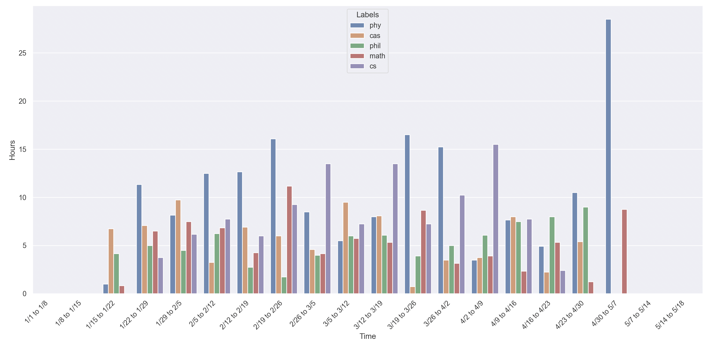

# Calendar Analysis Project
Sometimes time races past you, and before you know it, the day is over. This project is to help visualize where your time is going and hopefully help you stay motivated!

### Backstory
At the start of this year, I decided I would try time blocking. Time blocking is a time management method where you split your day into blocks of time for specific tasks. I did this mainly to be more organized for my classes, but I also wanted to visually see where I was spending my time and how much time I was spending on these specific tasks. That is where this project comes in. Now I can see graphs of how each week is going, how much total time I have spent on particular classes, and if I have had any 'streaks' of doing the same task every day consecutively. I hope that this can be helpful to others that use time blocking or frequently put events into their online calendars to get the most out of their day.

## Walk Through
1. Create CalendarData object. It needs the file path to the iCalendar, also known as the .ics file.

2. This object has two attributes, 'rawCalendarDF' and 'segmentedDF'.  

    - 'rawCalendarDF' is a DataFrame that contains the name, start time, end time, date, and time elapsed for all the events in your calendar file. 
    
    - 'segmentedDF' is initially None, but will be used to graph and store segmented information.

3. Now, use the 'calendarSegmenter' method on the CalendarData object. This takes in the following parameters: 'keywords', 'startDate', 'endDate', 'days' and or 'weeks'. Once you have run the 'calendarSegmenter' now the 'segmentedDF' attribute is available to you.

    - 'keywords' should be a list containing strings. The strings should be keywords that you want to be counted and analyzed. Example: ["phy", "math", "cas", "phil", "cs"]

    - 'startDate' and 'endDate' should be datetime.date objects. Make 'startDate' the date you want to start parsing from (inclusively) and 'endDate' the day to stop parsing at (noninclusive). 

    - 'days' and 'weeks' are optional. This is how you want to increment the calendar. If you want to see weekly statistics, then make weeks=1, or daily information make days=1. Maybe you want to see a breakdown of 1 week and 3 days, you just do days=3 weeks=1. If left blank it will the segment will be the entire time frame from start to end.

4. You can see a graph displaying the segmented data created from the 'calendarSegmenter' by using the 'graphing' method. Running the 'calendarSegmenter' is required to see the graph. At the bottom of this file is an example of how the graph looks.

5. Another feature is the ability to see if you have been staying consistent in doing your activities. Use the 'keywordStreakFinder' method, which requires the parameters 'keywords' and 'firstDate'. 

    'keywords' is should be a list of strings that contain what you want to search for. 'firstDate' is should be a datetime.date object that you want it to start looking from.

        Note: To avoid collisions it is recommended to add keywords that describe most of the events in the timeline. 
        
        For example: 
        Suppose some of my events have the word 'physics' in them. And I am searching for the keywords=['cs', 'phil', 'cas']. The events with the word physics would be counted toward the cs category because physics has the word cs in it. To avoid instances like this, have your keywords= ['cs', 'phil', 'cas', 'phy'] The order of the strings in the list do not matter as it is taken care of in the backend.

## Example Graph showing time spent on classes

## Potential Additions 
* Multi Calendar Support
* Google Calendar Support
* User Interface
